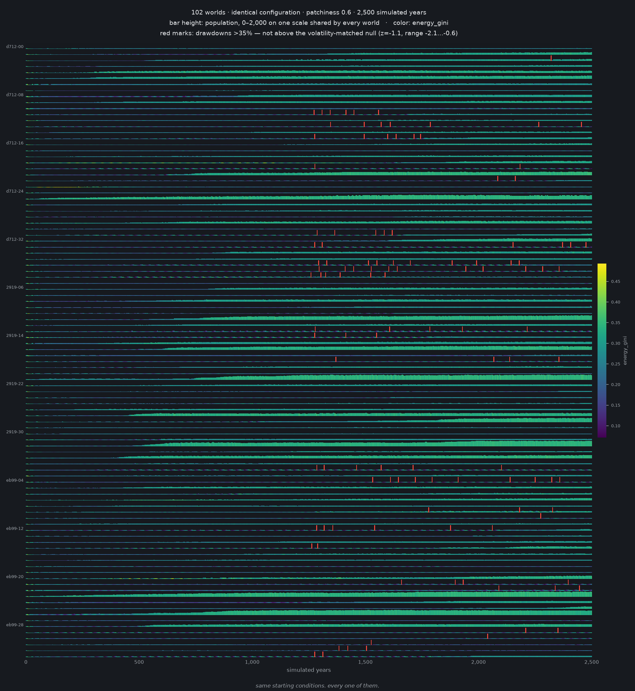

# Artificial Civilization

**A comparative history laboratory.**

It is not a world you watch; it is a machine that produces thousands of divergent histories from
controlled initial conditions, plus the tooling to ask causal questions of them. Agents are
numeric, not LLMs. They want one thing — energy above zero, and offspring — and every social
structure from trade to government must earn its place by being a better way of not dying.
Twelve primitives generate everything; no phenomenon is ever implemented directly. There is no
`war.py`, no collapse routine, no plague module — only primitives rich enough to make those
happen, and detectors that notice when they do.

The simulation is the instrument. The histories are the data. The science is comparative.

---

## Status

**Stage A0 — Skeleton: shipped.** The deterministic core runs. Array-based world, event log,
checkpoints, forking, and a determinism gate that holds: replay is bit-identical, and a no-op fork
reproduces its parent exactly — including with effects scheduled across the checkpoint boundary.

Measured on the target machine: **11 ms/tick** at 32 worlds × 1,000 agents, 4.68 ms per
world-year, 9 MB of Chronicle per world over 50,000 ticks. Full numbers and the three findings
that changed the design are in
[experiments/a0-baseline/result.md](experiments/a0-baseline/result.md).

**Stage A1 — First evolution: shipped.** Agents evolve. Over a run they get measurably better at
choosing the direction with more food in it, and a no-heredity control shows 95% of that
improvement is selection rather than the world changing underneath them.

The result nobody predicted: **patchier worlds select for more random movement, not less.** Agents
did not stop caring about the local resource gradient — gradient sensitivity rose slightly
everywhere — they stopped acting on it deterministically, because in a mostly-barren world the
local gradient is mostly noise. They evolved to calibrate how much to trust local information to
how much that information was worth. See
[experiments/a1-gradient-ascent/result.md](experiments/a1-gradient-ascent/result.md).

**Stage A2 — First picture: shipped.** A hundred and two worlds from one configuration, stacked.



Each band is one world's entire history — bar height is population, color is energy inequality, red
marks are drawdowns. They were run from an **identical configuration** and differ only in which
random draws they got. By year 2,500 they differ from each other **9.4× more than each one
fluctuates over time**, and final populations span tenfold. Nothing in the design makes them
diverge; nothing stops them either.

That premise had been asserted in every document and never measured. It is what the corpus rests
on: if a hundred worlds under one config converged, the replication unit would not replicate. See
[experiments/a2-wall/result.md](experiments/a2-wall/result.md), and
[atlas/wall.template.html](atlas/wall.template.html) for the interactive version.

**Next:** A3 — the Historian.

Design is frozen and lives in [`docs/`](docs/). Start with
[docs/README.md](docs/README.md) for the reading order — or
[docs/00-feasibility.md](docs/00-feasibility.md) if you want to know what this can and cannot do
on the hardware it targets (an 8 GB M1 Air).

---

## Quickstart

Requires [uv](https://docs.astral.sh/uv/) and Python 3.13.

```bash
uv sync --all-extras          # exact versions from uv.lock
uv run pytest                 # the determinism gate — must be green before anything else

# measure this machine; every scale decision depends on these numbers
uv run python -m bench.bench_tick --scales all

# a run: 32 worlds from one seed, written to corpus/runs/<run_id>/
uv run python -m forge.run configs/frozen/a0_smoke.yaml --seed 0 --ticks 5000

# a sweep: every parameter point, every seed, scored by the detector suite
uv run python -m forge.sweep experiments/a1-patchiness/spec.yaml

# a picture: digest a run, then stack every world in the experiment
uv run python -m digest.build corpus/runs/<run_id>
uv run python tools/render_wall.py corpus/runs/*/digest.json -o wall.png
uv run python tools/build_atlas.py corpus/runs/*/digest.json   # -> atlas/wall.html
```

Runs land in `corpus/`, which is git-ignored — a run is regenerable from `(config, seed)` by
construction, so there is nothing there worth committing.

---

## Layout

```
docs/          canonical design — 17 documents, the single source of truth
src/
  core/        the world. no strings, no phenomenon names, no I/O beyond event emission
  chronicle/   event log, sharding, checkpoints
  lens/        detectors and their null models — one file per detector
  forge/       runs, sweeps, forks
  digest/      Chronicle -> the versioned viz digest the Atlas reads
atlas/         the viewer — one self-contained HTML file, no build step
tools/         rendering and doc checks; never imported by the simulation
configs/       frozen defaults and experiment configs
experiments/   spec.yaml + result.md per experiment, including negative results
schemas/       versioned event and digest schemas
tests/         the determinism gate
bench/         performance measurement; cost-per-world-year is a tracked metric
```

## The rules that shape the code

Four invariants hold from commit #1, because retrofitting any of them is agony:

1. **Determinism** — a run is a pure function of `(config, seed)`; replay is bit-identical.
2. **Event sourcing** — if a fact isn't in the Chronicle, it does not exist for analysis.
3. **Forkability** — rewind to tick T, change one thing, re-run.
4. **Array state** — agents are columns, not objects; worlds are a batch axis.

And two conventions worth knowing before reading `src/`:

- **No phenomenon names in `src/core/`.** Words like *war*, *trade*, and *revolution* live only in
  `src/lens/`, where they name measurements rather than mechanisms.
- **No detector without a null model.** A measurement without one is a plot, not a result.
- **The Atlas reads a digest, never live state.** Nothing rendered can affect a run, and the
  detector's verdict travels with its markers so a picture cannot imply significance the data has
  not earned.

See [docs/DECISIONS.md](docs/DECISIONS.md) for every design decision and what was rejected.
