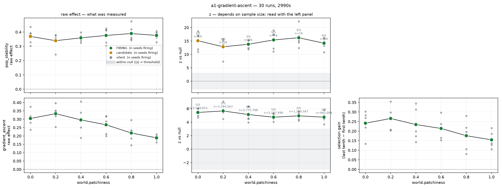

# a1-gradient-ascent — result

**Status: the detector fires; the hypothesis is again wrong; A1's criteria are met.**
30 runs (6 patchiness levels × 5 seeds), 16 worlds each, 15,000 ticks, 50 minutes.
Spec: [spec.yaml](spec.yaml). Control: [a1-heredity-control](../a1-heredity-control/result.md).

---

## What was asked

Two questions, deliberately kept apart:

1. **Do agents ascend resource gradients?** — magnitude against the blind-choice null.
2. **Does selection improve it, and more so in patchy worlds?** — `advantage_delta`, the last tenth
   of a run against the first.

Only the second is an evolutionary claim. At stage S0 the policy already weighs the gradient and
the founding cohort draws `gradient_sensitivity` uniformly, so agents ascend from tick zero; a
positive magnitude means the mechanism works, not that anything evolved.

## What happened

| patchiness | mean pop | advantage | took best | **selection gain** | worlds improved | z |
|---|---|---|---|---|---|---|
| 0.0 | 559 | 0.304 | 0.461 | +0.241 | 12.6 / 16 | 5.4 |
| 0.2 | 540 | 0.333 | 0.484 | +0.266 | 13.8 / 16 | 5.7 |
| 0.4 | 441 | 0.296 | 0.466 | +0.234 | 11.6 / 16 | 5.1 |
| 0.6 | 344 | 0.267 | 0.447 | +0.214 | 13.2 / 16 | 4.7 |
| 0.8 | 203 | 0.218 | 0.388 | +0.176 | 13.2 / 16 | 4.9 |
| 1.0 | 68 | 0.189 | 0.354 | +0.154 | 12.0 / 16 | 4.7 |

**`gradient_ascent` fires at every level, 5 seeds of 5.** Advantage is +0.268 on average and
positive in **30 runs of 30**; took-best share runs 0.354–0.484 against a blind 0.25; direction bias
is 0.252 where 0.25 is perfectly unbiased, so agents are climbing a gradient rather than drifting
one way and being credited for it.

**Selection gain is positive in 30 runs of 30** — advantage roughly triples over a run, from ~0.13
to ~0.34 — and [the heredity control](../a1-heredity-control/result.md) shows 95% of that is
selection rather than the world changing underneath.

## The dose-response is negative, for the second time in this stage

`corr(patchiness, advantage) = −0.926`. `corr(patchiness, selection gain) = −0.921`.

Gradient-following gets **weaker** as resources clump — the opposite of the prediction, and the
opposite in the same direction the withdrawn `directed_foraging` was wrong.

### Why: the agents evolved to distrust local information

The gene means say it plainly. Every gene starts uniform on [0, 1] with mean 0.500.

| gene | patchiness 0.0 | patchiness 1.0 | corr with patchiness |
|---|---|---|---|
| exploration temperature | 0.197 | 0.373 | **+0.937** |
| heading persistence | 0.454 | 0.258 | **−0.848** |
| gradient sensitivity | 0.636 | 0.688 | +0.668 |
| hunger threshold | 0.567 | 0.650 | +0.711 |
| reproduce threshold | 0.006 | 0.068 | +0.619 |
| metabolic rate | 0.015 | 0.046 | +0.464 |

Seven of eight genes moved substantially off 0.500. Two track patchiness hard: **patchier worlds
select for more randomness and less commitment to a heading.**

That is the whole mechanism. Higher exploration temperature flattens the softmax, which loosens the
coupling between the perceived sector scores and the direction actually taken — so measured
advantage falls. Gradient sensitivity did *not* fall; it rose slightly at every patchiness. Agents
did not stop caring about the gradient. **They stopped acting on it deterministically.**

And there is a reason to. A patchy world is mostly barren floor, where the local gradient reflects
depletion noise rather than anything worth walking toward. The informative thing to do when local
information is uninformative is to ignore it and cover ground. Nothing in the fitness function
mentions information quality; the only thing selection was ever told to prefer is offspring
([D-007](../../docs/DECISIONS.md#d-007)).

> Agents evolved to calibrate how much to trust local information to how much that information is
> worth. That is a more interesting finding than the one the experiment set out to confirm.

### `pop_stability`

Regulation is strong at every level (z = 12.8–16.2, coefficient 0.34–0.39 against a null near 0.10),
but the detector only fires at patchiness ≥ 0.4 because firing also requires ≥90% of worlds in the
viable band. At 0.0–0.2 about 2–3 worlds in 16 fail the boundedness test. That is now a real
property of those worlds rather than the array-ceiling artifact that spoiled
[a1-patchiness](../a1-patchiness/result.md) — mean population is 62% of capacity, not 88%.

## A1 ship criteria

| Criterion | Verdict |
|---|---|
| population bounded oscillation, no extinction or explosion, ≥20 seeds | ✅ at patchiness ≥ 0.4 (80 world-instances); marginal below |
| trait means drift measurably and **track the resource distribution** | ✅ 7/8 genes move off 0.500; two track patchiness at \|r\| > 0.84 |
| a foraging detector beats its null | ✅ `gradient_ascent`, 30/30 runs, 5/5 seeds at all six levels |

**A1 ships.** The pipeline — sim → log → sweep → detector → null → plot — is proven end to end, and
it has now produced a real result rather than only catching its own errors.

## Method notes worth keeping

**z stopped tracking population.** Sample size varies 7.6× across this sweep (3.5M rows down to
465k) while z sits flat at ~5. In [a1-patchiness](../a1-patchiness/result.md) that same variation
manufactured a spurious dose-response at r = 0.97. The difference is clustering by world: the
replication unit is 16 worlds, not three million correlated moves
([D-054](../../docs/DECISIONS.md#d-054)).

**The null was derived, not simulated.** A blind agent's expected chosen score *is* the mean of what
was on offer, so the null centre is exactly zero for any landscape, with nothing to generate
([D-058](../../docs/DECISIONS.md#d-058)). No permutation, and therefore no permutation blind spot of
the kind that killed the previous detector.

## What this opens

The exploration-temperature result is the interesting thread. It says agents tune their reliance on
a signal to that signal's reliability — which is the S0 shadow of something the project cares about
a great deal later: **belief calibrated to evidence quality**, the machinery the Chronicle Gap runs
on. Worth a dedicated experiment before Phase D assumes it.
