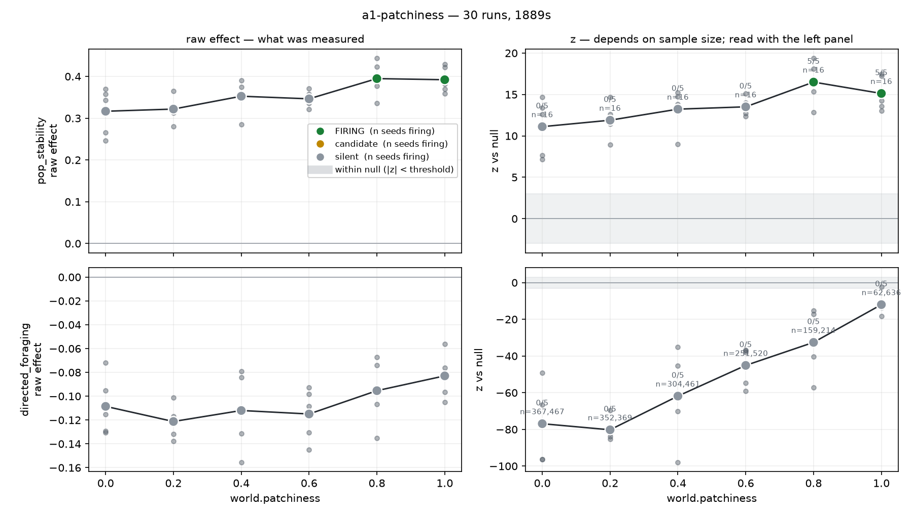

# a1-patchiness — result

**Status: hypothesis not supported.** 30 runs (6 patchiness levels × 5 seeds), 16 worlds each,
15,000 ticks, 31 minutes total. Spec: [spec.yaml](spec.yaml). Data: `results.json`.

---

## The hypothesis

Directed foraging should be worth more in a patchy world than in a uniform one, because clumped
resources reward committing to a direction. So `directed_foraging` — path straightness when hungry,
minus path straightness when sated — should **rise with `world.patchiness`**.

## What happened

| patchiness | mean pop | raw effect | z vs null | n windows | seeds firing |
|---|---|---|---|---|---|
| 0.0 | 442 | −0.109 | −76.9 | 367,467 | 0/5 |
| 0.2 | 430 | −0.121 | −80.2 | 352,369 | 0/5 |
| 0.4 | 378 | −0.112 | −61.8 | 304,461 | 0/5 |
| 0.6 | 326 | −0.115 | −45.1 | 251,520 | 0/5 |
| 0.8 | 207 | −0.095 | −32.6 | 159,215 | 0/5 |
| 1.0 | 79 | −0.083 | −12.0 | 62,637 | 0/5 |

**Two findings, and the second matters more than the first.**

### 1. The effect is real, robust, and the wrong sign

Across all 30 runs the raw effect is **−0.106 ± 0.025**, negative in **30 of 30**. Hungry agents
are consistently *less* path-straight than sated ones — about 0.44 straightness against 0.56 — and
this holds at every patchiness level and in every seed.

It does not grow with patchiness. The raw effect moves from −0.109 to −0.083 across the entire
sweep, a change of 0.026 against a between-seed standard deviation of 0.025. That is roughly one
seed's worth of noise. `directed_foraging` never fires, at any setting, because the effect is
consistently on the wrong side of zero.

### 2. The dose-response curve was an artifact — and it was convincing

Plotted as z against the null, this sweep produces **exactly the curve the hypothesis predicted**:
monotonic, smooth, correlated with patchiness at **r = 0.973**.

It means nothing. Patchier worlds support fewer agents (442 → 79). Fewer agents log fewer
trajectories (367k → 63k windows). Fewer windows widen the null (σ 0.0011 → 0.0021). So z rises
while the thing being measured stays flat.

> **Population is an outcome variable in this project.** Any swept parameter that moves population
> moves every sample size, and therefore moves every z-score, for reasons that have nothing to do
> with behavior.

Had this been reported as z alone — the obvious thing to plot, and what the detector returns first
— it would have been a confident, clean-looking, completely wrong result on the project's very
first experiment. It is now [D-054](../../docs/DECISIONS.md#d-054), and `tools/plot_sweep.py`
renders raw and z side by side so the pairing cannot be skipped.

### `pop_stability`

Regulation is strong everywhere (z = 11–17, raw coefficient 0.32–0.39 against a null of ~0.10), but
the detector only **fires at patchiness ≥ 0.8**, because firing also requires worlds to be in the
viable band. Below 0.8 they are not: uniform worlds are resource-rich, populations run at 86–88% of
the 500-agent array capacity, and a population pressed against its array ceiling is regulated by
the array rather than by the world.

That is a **calibration artifact, not a finding about regulation.** The honest statement is that
regulation is present at every patchiness and that this config's capacity is too low to demonstrate
it cleanly below 0.8.

---

## Why the sign is negative

**Resolved by [a1-hunger-coupling](../a1-hunger-coupling/result.md): the causation runs backwards.**

The first explanation was that the policy caused it — `choose_action` weighted the resource
gradient lower for sated agents, so hungry agents would steer by a noisy gradient and wiggle. That
was tested by making the constant a config parameter and sweeping it to 1.0, where hunger no longer
affects gradient weighting at all. **The effect got 34% stronger, not weaker.** Prediction
falsified.

The real mechanism is that **straight movement causes satiation**, not the reverse. Straightness
correlates with energy *gained* across a window (+0.224) more than twice as strongly as with energy
*held* before it (+0.102). Harvesting empties a cell, so an agent travelling in a straight line
keeps entering fresh ground and eats well, while one that doubles back re-crosses what it already
stripped. Straight movers become the sated ones.

So `directed_foraging` conditions on energy — an outcome of the behavior it is measuring — and
reads the resulting correlation as if hunger drove the movement. The within-agent shuffled null
does not catch it, because the confound is temporal and permutation destroys temporal order.

This is a **construct validity failure** in the detector as specified in
[07-detectors.md](../../docs/07-detectors.md), and it is not repairable with a better null. See
[D-056](../../docs/DECISIONS.md#d-056).

---

## Consequences

**A1 does not ship.** Its criteria require `directed_foraging` to beat its shuffled null; it does
not, and the reason is more interesting than the criterion.

Three things follow:

1. **Redefine the detector.** `directed_foraging` should measure movement *up the resource
   gradient*, not path straightness. Straightness conflates direction with persistence, and the two
   come apart exactly when hunger is involved — which is the only case the detector looks at.
2. **Raise `population.capacity`** in the A1 config, or lower `gather_efficiency`, so that low
   patchiness is not saturated. A sweep whose low end sits against the array ceiling is comparing
   two different regimes and calling it a dose-response.
3. **Evolve the coupling.** If `sated_gradient_factor` proves load-bearing, hunger-conditioned
   gradient weighting should be a gene rather than a constant — the structure itself is a claim
   about behavior that we made rather than discovered.

## What did work

The pipeline. `sim → log → sweep → detector → null → plot` ran end to end, 30 runs unattended in
31 minutes, and it **caught its own false positive**. The null models did their job: the shuffled
null is what revealed that the apparent dose-response was sampling, and the seed scatter is what
showed the raw effect was flat. That is the machinery A1 exists to prove, and it works.

A negative result on the first experiment, found in half an hour rather than in month eight, is the
outcome this stage was ordered early to produce.
